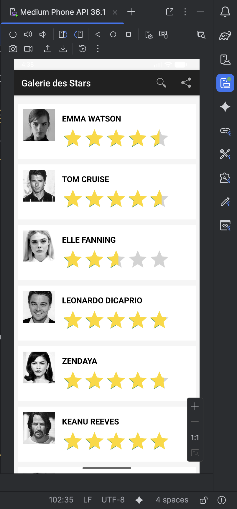
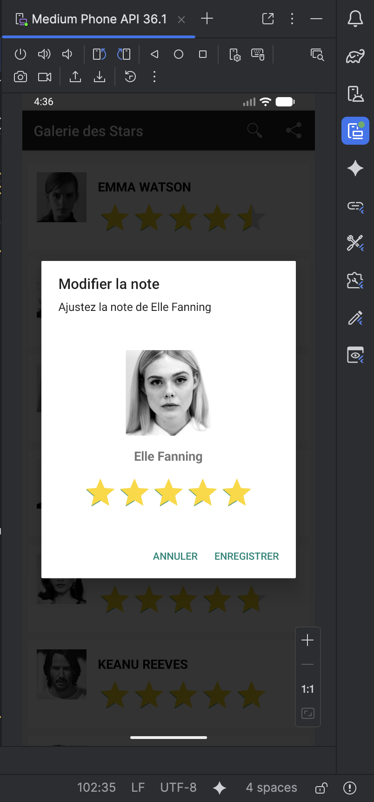
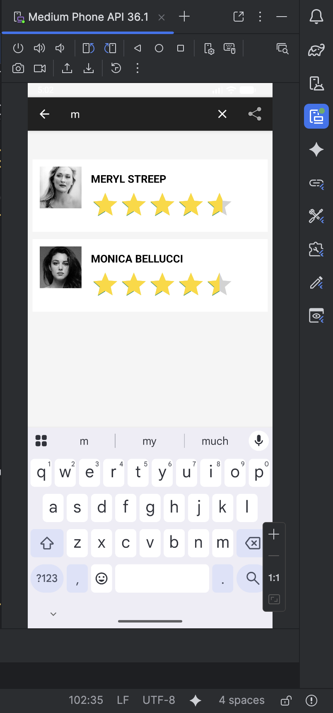
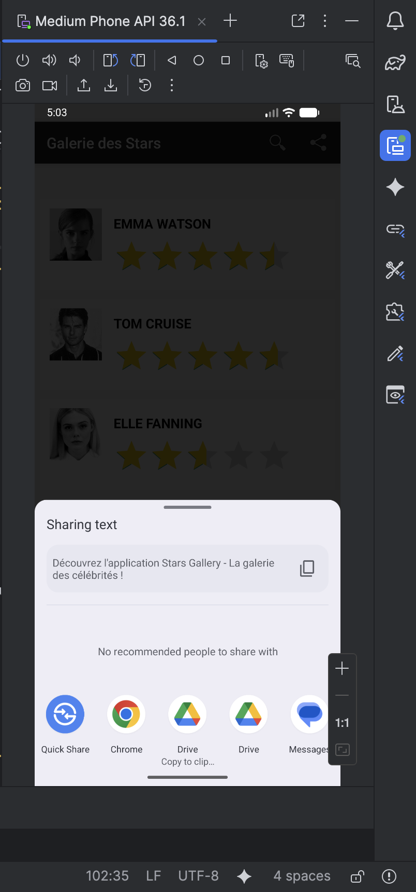

Voici le fichier README complet avec l'espace pour la vidéo démo :

---

# LAB 7 – Galerie de Stars : RecyclerView, Animations et Filtrage ⭐

## Aperçu de l'application

Une application Android complète permettant d'afficher une galerie de célébrités sous forme de liste avec images, notes (RatingBar), filtrage dynamique par nom, animations d'introduction, modification des notes via popup et partage de l'application.

## 🎥 Vidéo de démonstration

<div align="center">
  
### Démo de l'application 

https://github.com/user-attachments/assets/demo

> **Remarque** : La vidéo de démonstration montre le fonctionnement complet de l'application :
> - Animation du splash screen
> - Affichage de la liste des célébrités
> - Filtrage dynamique via la barre de recherche
> - Modification des notes via popup
> - Menu de partage de l'application

</div>

## 📱 Captures d'écran

| Écran Initial | Étoiles avant modification | Étoiles après modification |
|---------------|---------------------------|----------------------------|
|  |  |  |

| Recherche / Filtrage | Menu de Partage |
|---------------------|-----------------|
|  |  |

## ✨ Fonctionnalités

- **Splash Screen animé** : logo avec animations de rotation, réduction, translation et disparition progressive
- **Liste verticale (RecyclerView)** : affichage des célébrités avec photos et notes (étoiles jaunes)
- **Filtrage dynamique** : barre de recherche (SearchView) pour filtrer par nom en temps réel
- **Modification des notes** : popup personnalisé pour ajuster la note (RatingBar) d'une célébrité
- **Menu de partage** : partage de l'application via les applications installées (WhatsApp, Gmail, Messages, etc.)

## 🏗️ Architecture du projet

```
lab7_dev/
├── app/src/main/
│   ├── java/com.example.lab7_dev/
│   │   ├── beans/
│   │   │   └── Celebrity.java
│   │   ├── dao/
│   │   │   └── IGenericDao.java
│   │   ├── service/
│   │   │   └── CelebrityManager.java
│   │   ├── adapter/
│   │   │   └── CelebrityAdapter.java
│   │   └── ui/
│   │       ├── SplashScreenActivity.java
│   │       └── MainListActivity.java
│   └── res/
│       ├── layout/
│       │   ├── activity_splash.xml
│       │   ├── activity_main_list.xml
│       │   ├── celebrity_item.xml
│       │   └── rating_edit_dialog.xml
│       ├── menu/
│       │   └── main_menu.xml
│       ├── values/
│       │   ├── colors.xml
│       │   └── styles.xml
│       └── drawable/
│           ├── logo.png
│           ├── emma_watson.jpg
│           ├── tom_cruise.jpg
│           ├── elle_fanning.jpg
│           ├── leo.jpg
│           ├── zendaya.jpg
│           ├── keanu.jpg
│           ├── meryl.jpg
│           ├── brad.jpg
│           ├── angelina.jpg
│           └── monica_belluci.jpg
```

## 💻 Code source complet

### 1. Dépendances – `build.gradle.kts` (Module: app)

```kotlin
plugins {
    alias(libs.plugins.android.application)
}

android {
    namespace = "com.example.lab7_dev"
    compileSdk = 36

    defaultConfig {
        applicationId = "com.example.lab7_dev"
        minSdk = 24
        targetSdk = 36
        versionCode = 1
        versionName = "1.0"

        testInstrumentationRunner = "androidx.test.runner.AndroidJUnitRunner"
    }

    buildTypes {
        release {
            isMinifyEnabled = false
            proguardFiles(
                getDefaultProguardFile("proguard-android-optimize.txt"),
                "proguard-rules.pro"
            )
        }
    }
    compileOptions {
        sourceCompatibility = JavaVersion.VERSION_11
        targetCompatibility = JavaVersion.VERSION_11
    }
}

dependencies {
    implementation("androidx.appcompat:appcompat:1.7.0")
    implementation("com.google.android.material:material:1.12.0")
    implementation("androidx.activity:activity:1.9.3")
    implementation("androidx.constraintlayout:constraintlayout:2.2.0")
    implementation("androidx.recyclerview:recyclerview:1.3.2")
    testImplementation("junit:junit:4.13.2")
    androidTestImplementation("androidx.test.ext:junit:1.2.1")
    androidTestImplementation("androidx.test.espresso:espresso-core:3.6.1")
}
```

### 2. Modèle de données – `beans/Celebrity.java`

```java
package com.example.lab7_dev.beans;

public class Celebrity {
    private int uniqueId;
    private String fullName;
    private String imageUrl;
    private float averageRating;
    private static int idGenerator = 0;

    public Celebrity(String fullName, String imageUrl, float averageRating) {
        this.uniqueId = ++idGenerator;
        this.fullName = fullName;
        this.imageUrl = imageUrl;
        this.averageRating = averageRating;
    }

    public int getUniqueId() { return uniqueId; }
    public String getFullName() { return fullName; }
    public String getImageUrl() { return imageUrl; }
    public float getAverageRating() { return averageRating; }

    public void setFullName(String fullName) { this.fullName = fullName; }
    public void setImageUrl(String imageUrl) { this.imageUrl = imageUrl; }
    public void setAverageRating(float averageRating) { this.averageRating = averageRating; }
}
```

### 3. DAO Générique – `dao/IGenericDao.java`

```java
package com.example.lab7_dev.dao;

import java.util.List;

public interface IGenericDao<T> {
    boolean insert(T object);
    boolean modify(T object);
    boolean remove(T object);
    T searchById(int id);
    List<T> retrieveAll();
}
```

### 4. Service – `service/CelebrityManager.java`

```java
package com.example.lab7_dev.service;

import com.example.lab7_dev.beans.Celebrity;
import com.example.lab7_dev.dao.IGenericDao;
import java.util.ArrayList;
import java.util.List;

public class CelebrityManager implements IGenericDao<Celebrity> {
    private List<Celebrity> celebrityList;
    private static CelebrityManager uniqueInstance;

    private CelebrityManager() {
        celebrityList = new ArrayList<>();
        initializeData();
    }

    public static CelebrityManager getUniqueInstance() {
        if (uniqueInstance == null) {
            uniqueInstance = new CelebrityManager();
        }
        return uniqueInstance;
    }

    private void initializeData() {
        celebrityList.add(new Celebrity("Emma Watson", "emma_watson", 4.5f));
        celebrityList.add(new Celebrity("Tom Cruise", "tom_cruise", 4.2f));
        celebrityList.add(new Celebrity("Elle Fanning", "elle_fanning", 4.3f));
        celebrityList.add(new Celebrity("Leonardo DiCaprio", "leo", 4.8f));
        celebrityList.add(new Celebrity("Zendaya", "zendaya", 4.7f));
        celebrityList.add(new Celebrity("Keanu Reeves", "keanu", 4.9f));
        celebrityList.add(new Celebrity("Meryl Streep", "meryl", 4.6f));
        celebrityList.add(new Celebrity("Brad Pitt", "brad", 4.4f));
        celebrityList.add(new Celebrity("Angelina Jolie", "angelina", 4.3f));
        celebrityList.add(new Celebrity("Monica Bellucci", "monica_belluci", 4.5f));
    }

    @Override public boolean insert(Celebrity object) { return celebrityList.add(object); }
    
    @Override public boolean modify(Celebrity object) {
        for (Celebrity celeb : celebrityList) {
            if (celeb.getUniqueId() == object.getUniqueId()) {
                celeb.setFullName(object.getFullName());
                celeb.setImageUrl(object.getImageUrl());
                celeb.setAverageRating(object.getAverageRating());
                return true;
            }
        }
        return false;
    }
    
    @Override public boolean remove(Celebrity object) { return celebrityList.remove(object); }
    
    @Override public Celebrity searchById(int id) {
        for (Celebrity celeb : celebrityList) {
            if (celeb.getUniqueId() == id) return celeb;
        }
        return null;
    }
    
    @Override public List<Celebrity> retrieveAll() { return celebrityList; }
}
```

### 5. Layout Écran de démarrage – `res/layout/activity_splash.xml`

```xml
<?xml version="1.0" encoding="utf-8"?>
<androidx.constraintlayout.widget.ConstraintLayout 
    xmlns:android="http://schemas.android.com/apk/res/android"
    xmlns:app="http://schemas.android.com/apk/res-auto"
    android:layout_width="match_parent"
    android:layout_height="match_parent"
    android:background="#FFFFFF">

    <ImageView
        android:id="@+id/appLogo"
        android:layout_width="180dp"
        android:layout_height="180dp"
        android:src="@drawable/logo"
        android:scaleType="fitCenter"
        app:layout_constraintTop_toTopOf="parent"
        app:layout_constraintBottom_toBottomOf="parent"
        app:layout_constraintStart_toStartOf="parent"
        app:layout_constraintEnd_toEndOf="parent" />
        
</androidx.constraintlayout.widget.ConstraintLayout>
```

### 6. SplashScreen – `ui/SplashScreenActivity.java`

```java
package com.example.lab7_dev.ui;

import android.animation.Animator;
import android.animation.AnimatorSet;
import android.animation.ObjectAnimator;
import android.content.Intent;
import android.os.Bundle;
import android.view.animation.AccelerateDecelerateInterpolator;
import android.widget.ImageView;
import androidx.appcompat.app.AppCompatActivity;
import com.example.lab7_dev.R;

public class SplashScreenActivity extends AppCompatActivity {

    @Override
    protected void onCreate(Bundle savedInstanceState) {
        super.onCreate(savedInstanceState);
        setContentView(R.layout.activity_splash);
        
        ImageView appLogo = findViewById(R.id.appLogo);
        
        // Animation de rotation
        ObjectAnimator rotation = ObjectAnimator.ofFloat(appLogo, "rotation", 0f, 360f);
        rotation.setDuration(2000);
        
        // Animation de réduction (Scale X et Y)
        ObjectAnimator scaleX = ObjectAnimator.ofFloat(appLogo, "scaleX", 1f, 0.5f);
        scaleX.setDuration(3000);
        scaleX.setStartDelay(500);
        
        ObjectAnimator scaleY = ObjectAnimator.ofFloat(appLogo, "scaleY", 1f, 0.5f);
        scaleY.setDuration(3000);
        scaleY.setStartDelay(500);
        
        // Animation de translation vers le bas
        ObjectAnimator translationY = ObjectAnimator.ofFloat(appLogo, "translationY", 0f, 1000f);
        translationY.setDuration(2000);
        translationY.setStartDelay(2000);
        
        // Animation de disparition (Alpha)
        ObjectAnimator alpha = ObjectAnimator.ofFloat(appLogo, "alpha", 1f, 0f);
        alpha.setDuration(1500);
        alpha.setStartDelay(3500);
        
        // Grouper toutes les animations
        AnimatorSet animatorSet = new AnimatorSet();
        animatorSet.playTogether(rotation, scaleX, scaleY, translationY, alpha);
        animatorSet.setInterpolator(new AccelerateDecelerateInterpolator());
        animatorSet.start();
        
        // Redirection vers l'activité principale après 5.5 secondes
        appLogo.postDelayed(() -> {
            startActivity(new Intent(SplashScreenActivity.this, MainListActivity.class));
            finish();
        }, 5500);
    }
}
```

### 7. Layout Item – `res/layout/celebrity_item.xml`

```xml
<?xml version="1.0" encoding="utf-8"?>
<RelativeLayout xmlns:android="http://schemas.android.com/apk/res/android"
    android:layout_width="match_parent"
    android:layout_height="wrap_content"
    android:padding="12dp"
    android:layout_marginTop="8dp"
    android:layout_marginBottom="4dp"
    android:background="@android:color/white">

    <ImageView
        android:id="@+id/celebrityImage"
        android:layout_width="70dp"
        android:layout_height="70dp"
        android:src="@drawable/ic_launcher_foreground"
        android:scaleType="centerCrop" />

    <TextView
        android:id="@+id/celebrityName"
        android:layout_width="wrap_content"
        android:layout_height="wrap_content"
        android:layout_toEndOf="@id/celebrityImage"
        android:layout_marginStart="16dp"
        android:layout_marginTop="8dp"
        android:textSize="18sp"
        android:textStyle="bold"
        android:textColor="#000000" />

    <RatingBar
        android:id="@+id/ratingBar"
        android:layout_width="wrap_content"
        android:layout_height="wrap_content"
        android:layout_below="@id/celebrityName"
        android:layout_toEndOf="@id/celebrityImage"
        android:numStars="5"
        android:stepSize="0.1"
        android:isIndicator="true"
        android:layout_marginStart="16dp"
        android:layout_marginTop="8dp"
        android:progressTint="@color/star_yellow"
        android:progressBackgroundTint="@color/star_gray" />
        
    <TextView
        android:id="@+id/celebrityId"
        android:layout_width="wrap_content"
        android:layout_height="wrap_content"
        android:visibility="gone" />
</RelativeLayout>
```

### 8. Layout Dialog Modification – `res/layout/rating_edit_dialog.xml`

```xml
<?xml version="1.0" encoding="utf-8"?>
<LinearLayout xmlns:android="http://schemas.android.com/apk/res/android"
    android:orientation="vertical"
    android:padding="24dp"
    android:layout_width="match_parent"
    android:layout_height="wrap_content"
    android:gravity="center_horizontal">

    <TextView
        android:id="@+id/dialogCelebrityId"
        android:layout_width="wrap_content"
        android:layout_height="wrap_content"
        android:visibility="gone" />

    <ImageView
        android:id="@+id/dialogCelebrityImage"
        android:layout_width="120dp"
        android:layout_height="120dp"
        android:src="@drawable/ic_launcher_foreground"
        android:scaleType="centerCrop"
        android:layout_marginBottom="16dp" />

    <TextView
        android:id="@+id/dialogCelebrityName"
        android:layout_width="wrap_content"
        android:layout_height="wrap_content"
        android:textSize="18sp"
        android:textStyle="bold"
        android:layout_marginBottom="16dp" />

    <RatingBar
        android:id="@+id/dialogRatingBar"
        android:layout_width="wrap_content"
        android:layout_height="wrap_content"
        android:numStars="5"
        android:stepSize="0.1"
        android:clickable="true"
        android:progressTint="@color/star_yellow"
        android:progressBackgroundTint="@color/star_gray" />
        
</LinearLayout>
```

### 9. Adapter – `adapter/CelebrityAdapter.java`

```java
package com.example.lab7_dev.adapter;

import android.content.Context;
import android.view.LayoutInflater;
import android.view.View;
import android.view.ViewGroup;
import android.widget.ImageView;
import android.widget.RatingBar;
import android.widget.TextView;
import android.widget.Filter;
import android.widget.Filterable;
import androidx.annotation.NonNull;
import androidx.appcompat.app.AlertDialog;
import androidx.recyclerview.widget.RecyclerView;
import com.example.lab7_dev.R;
import com.example.lab7_dev.beans.Celebrity;
import com.example.lab7_dev.service.CelebrityManager;
import java.util.ArrayList;
import java.util.List;

public class CelebrityAdapter extends RecyclerView.Adapter<CelebrityAdapter.CelebrityViewHolder> implements Filterable {

    private List<Celebrity> originalCelebrityList;
    private List<Celebrity> filteredCelebrityList;
    private Context appContext;
    private CustomFilter searchFilter;

    public CelebrityAdapter(Context context, List<Celebrity> celebrities) {
        this.appContext = context;
        this.originalCelebrityList = celebrities;
        this.filteredCelebrityList = new ArrayList<>(celebrities);
        this.searchFilter = new CustomFilter();
    }

    private int getImageResource(String imageName) {
        switch (imageName) {
            case "emma_watson": return R.drawable.emma_watson;
            case "tom_cruise": return R.drawable.tom_cruise;
            case "elle_fanning": return R.drawable.elle_fanning;
            case "leo": return R.drawable.leo;
            case "zendaya": return R.drawable.zendaya;
            case "keanu": return R.drawable.keanu;
            case "meryl": return R.drawable.meryl;
            case "brad": return R.drawable.brad;
            case "angelina": return R.drawable.angelina;
            case "monica_belluci": return R.drawable.monica_belluci;
            default: return R.drawable.ic_launcher_foreground;
        }
    }

    @NonNull
    @Override
    public CelebrityViewHolder onCreateViewHolder(@NonNull ViewGroup parent, int viewType) {
        View itemView = LayoutInflater.from(appContext).inflate(R.layout.celebrity_item, parent, false);
        return new CelebrityViewHolder(itemView);
    }

    @Override
    public void onBindViewHolder(@NonNull CelebrityViewHolder holder, int position) {
        Celebrity currentCelebrity = filteredCelebrityList.get(position);
        
        holder.celebrityName.setText(currentCelebrity.getFullName().toUpperCase());
        holder.ratingBar.setRating(currentCelebrity.getAverageRating());
        holder.celebrityImage.setImageResource(getImageResource(currentCelebrity.getImageUrl()));
        
        // Clic pour modifier la note
        holder.itemView.setOnClickListener(v -> {
            View dialogView = LayoutInflater.from(appContext).inflate(R.layout.rating_edit_dialog, null, false);
            
            ImageView dialogImg = dialogView.findViewById(R.id.dialogCelebrityImage);
            RatingBar dialogRating = dialogView.findViewById(R.id.dialogRatingBar);
            TextView dialogName = dialogView.findViewById(R.id.dialogCelebrityName);
            
            dialogImg.setImageResource(getImageResource(currentCelebrity.getImageUrl()));
            dialogName.setText(currentCelebrity.getFullName());
            dialogRating.setRating(currentCelebrity.getAverageRating());
            
            new AlertDialog.Builder(appContext)
                .setTitle("Modifier la note")
                .setMessage("Ajustez la note de " + currentCelebrity.getFullName())
                .setView(dialogView)
                .setPositiveButton("Enregistrer", (dialog, which) -> {
                    float newRating = dialogRating.getRating();
                    currentCelebrity.setAverageRating(newRating);
                    CelebrityManager.getUniqueInstance().modify(currentCelebrity);
                    notifyItemChanged(position);
                })
                .setNegativeButton("Annuler", null)
                .show();
        });
    }

    @Override
    public int getItemCount() { return filteredCelebrityList.size(); }
    
    @Override
    public Filter getFilter() { return searchFilter; }

    public static class CelebrityViewHolder extends RecyclerView.ViewHolder {
        ImageView celebrityImage;
        TextView celebrityName;
        RatingBar ratingBar;
        
        public CelebrityViewHolder(@NonNull View itemView) {
            super(itemView);
            celebrityImage = itemView.findViewById(R.id.celebrityImage);
            celebrityName = itemView.findViewById(R.id.celebrityName);
            ratingBar = itemView.findViewById(R.id.ratingBar);
        }
    }

    private class CustomFilter extends Filter {
        @Override
        protected FilterResults performFiltering(CharSequence constraint) {
            List<Celebrity> filteredResults = new ArrayList<>();
            if (constraint == null || constraint.length() == 0) {
                filteredResults.addAll(originalCelebrityList);
            } else {
                String searchPattern = constraint.toString().toLowerCase().trim();
                for (Celebrity celebrity : originalCelebrityList) {
                    if (celebrity.getFullName().toLowerCase().startsWith(searchPattern)) {
                        filteredResults.add(celebrity);
                    }
                }
            }
            FilterResults results = new FilterResults();
            results.values = filteredResults;
            results.count = filteredResults.size();
            return results;
        }
        
        @Override
        protected void publishResults(CharSequence constraint, FilterResults results) {
            filteredCelebrityList = (List<Celebrity>) results.values;
            notifyDataSetChanged();
        }
    }
}
```

### 10. Activité Principale – `ui/MainListActivity.java`

```java
package com.example.lab7_dev.ui;

import android.os.Bundle;
import android.view.Menu;
import android.view.MenuItem;
import androidx.appcompat.app.AppCompatActivity;
import androidx.appcompat.widget.SearchView;
import androidx.core.app.ShareCompat;
import androidx.recyclerview.widget.LinearLayoutManager;
import androidx.recyclerview.widget.RecyclerView;
import com.example.lab7_dev.R;
import com.example.lab7_dev.adapter.CelebrityAdapter;
import com.example.lab7_dev.service.CelebrityManager;

public class MainListActivity extends AppCompatActivity {
    
    private RecyclerView mainRecyclerView;
    private CelebrityAdapter celebrityAdapter;
    
    @Override
    protected void onCreate(Bundle savedInstanceState) {
        super.onCreate(savedInstanceState);
        setContentView(R.layout.activity_main_list);
        
        mainRecyclerView = findViewById(R.id.celebrityRecyclerView);
        mainRecyclerView.setLayoutManager(new LinearLayoutManager(this));
        mainRecyclerView.setPadding(0, 50, 0, 0);
        
        celebrityAdapter = new CelebrityAdapter(this, CelebrityManager.getUniqueInstance().retrieveAll());
        mainRecyclerView.setAdapter(celebrityAdapter);
        
        if (getSupportActionBar() != null) {
            getSupportActionBar().setTitle("Galerie des Stars");
        }
    }
    
    @Override
    public boolean onCreateOptionsMenu(Menu menu) {
        getMenuInflater().inflate(R.menu.main_menu, menu);
        
        MenuItem searchMenuItem = menu.findItem(R.id.action_search);
        SearchView searchView = (SearchView) searchMenuItem.getActionView();
        
        if (searchView != null) {
            searchView.setOnQueryTextListener(new SearchView.OnQueryTextListener() {
                @Override
                public boolean onQueryTextSubmit(String query) { return false; }
                
                @Override
                public boolean onQueryTextChange(String newText) {
                    if (celebrityAdapter != null) {
                        celebrityAdapter.getFilter().filter(newText);
                    }
                    return true;
                }
            });
        }
        return true;
    }
    
    @Override
    public boolean onOptionsItemSelected(MenuItem item) {
        if (item.getItemId() == R.id.action_share) {
            ShareCompat.IntentBuilder.from(this)
                .setType("text/plain")
                .setChooserTitle("Partager Stars Gallery")
                .setText("Découvrez l'application Stars Gallery - La galerie des célébrités !")
                .startChooser();
            return true;
        }
        return super.onOptionsItemSelected(item);
    }
}
```

### 11. Couleurs – `res/values/colors.xml`

```xml
<?xml version="1.0" encoding="utf-8"?>
<resources>
    <color name="black">#FF000000</color>
    <color name="white">#FFFFFFFF</color>
    <color name="star_yellow">#FFD700</color>
    <color name="star_gray">#D3D3D3</color>
    <color name="background">#F5F5F5</color>
</resources>
```

### 12. Menu – `res/menu/main_menu.xml`

```xml
<?xml version="1.0" encoding="utf-8"?>
<menu xmlns:android="http://schemas.android.com/apk/res/android"
    xmlns:app="http://schemas.android.com/apk/res-auto">
    
    <item
        android:id="@+id/action_search"
        android:title="Rechercher"
        android:icon="@android:drawable/ic_menu_search"
        app:showAsAction="always|collapseActionView"
        app:actionViewClass="androidx.appcompat.widget.SearchView" />
        
    <item
        android:id="@+id/action_share"
        android:title="Partager"
        android:icon="@android:drawable/ic_menu_share"
        app:showAsAction="always" />
        
</menu>
```

## 🚀 Comment exécuter l'application

1. **Créer un projet** Android Studio avec "Empty Views Activity"
2. **Nom du projet** : `lab7_dev`
3. **Package name** : `com.example.lab7_dev`
4. **Langage** : Java
5. **API minimum** : 24 (Android 7.0)
6. **Ajouter les dépendances** dans `build.gradle.kts`
7. **Ajouter le logo** `logo.png` dans `res/drawable/`
8. **Ajouter les images** des célébrités dans `res/drawable/`
9. **Remplacer tous les fichiers** par les codes ci-dessus
10. **Compiler** et exécuter sur émulateur ou appareil physique

## 📊 Fonctionnement

| Action | Résultat |
|--------|----------|
| Lancement de l'app | Splash screen animé (rotation, réduction, translation, disparition) |
| Saisie dans la barre de recherche (pic5) | Filtrage dynamique de la liste par nom |
| Clic sur une célébrité | Ouverture d'un popup pour modifier la note |
| Validation de la nouvelle note | Mise à jour immédiate de l'étoile (pic3) |
| Clic sur l'icône de partage (pic6) | Choix de l'application de partage (WhatsApp, Gmail, etc.) |


## 🎓 Points techniques abordés

- **RecyclerView & ViewHolder** : affichage performant de listes
- **Adapter personnalisé** : liaison entre données et interface
- **Filterable interface** : filtrage dynamique avec SearchView (pic5)
- **Animations** : rotation, translation, scale et alpha pour le splash screen
- **ObjectAnimator & AnimatorSet** : animations professionnelles
- **AlertDialog personnalisé** : popup pour modifier les notes
- **RatingBar** : affichage et modification des étoiles avec couleur jaune
- **Singleton pattern** : gestion centralisée des données
- **CRUD operations** : Create, Read, Update, Delete via DAO générique
- **ShareCompat** : partage d'application (pic6)
- **Images locales** : chargement sans bibliothèques externes

---
**Auteur** : ELHEZZAM RANIA  
**Réalisé avec** : Android Studio sur MacOS Apple Silicon M2 (ARM-64 Native)  
**Date** : Mai 2026  
